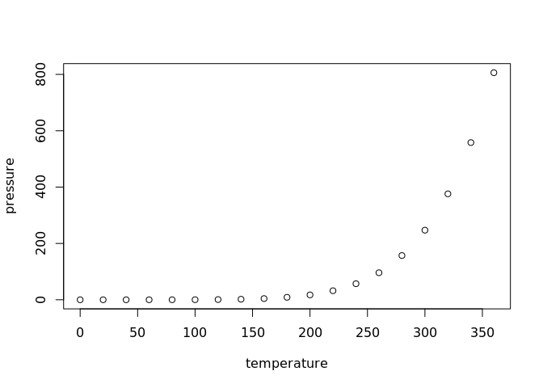

Meteorite Data
================

Trabalho Final
--------------

Para o trabalho final(mandar uma tarball/zip):

-   Relatório -&gt; PDF, como pegou os dados, quais tipos de dados, se teve que classificar
-   Código .R -&gt; source("file.R")
-   Figuras (plots)
-   E os dados em si

Objective
---------

This is a repository to keep my sample project, in which i'll try to analyze the data from some meteorite data published by NASA. I'm new to R, so bear with me for a few rookie mistakes.

GitHub Documents
----------------

This is an R Markdown format used for publishing markdown documents to GitHub. When you click the **Knit** button all R code chunks are run and a markdown file (.md) suitable for publishing to GitHub is generated.

Including Code
--------------

You can include R code in the document as follows:

``` r
summary(cars)
```

    ##      speed           dist       
    ##  Min.   : 4.0   Min.   :  2.00  
    ##  1st Qu.:12.0   1st Qu.: 26.00  
    ##  Median :15.0   Median : 36.00  
    ##  Mean   :15.4   Mean   : 42.98  
    ##  3rd Qu.:19.0   3rd Qu.: 56.00  
    ##  Max.   :25.0   Max.   :120.00

Including Plots
---------------

You can also embed plots, for example:



Note that the `echo = FALSE` parameter was added to the code chunk to prevent printing of the R code that generated the plot.
